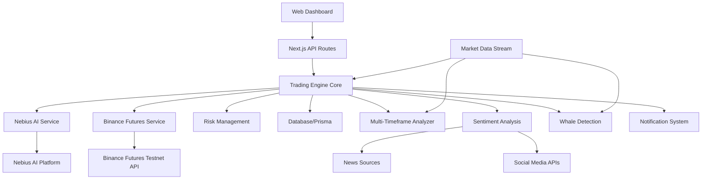

# Live Trading Bot AI - Design Document

## Overview

The Live Trading Bot AI is a sophisticated automated futures trading system that combines artificial intelligence from Nebius AI platform with real-time market execution through Binance Futures Testnet. The system processes live market data, generates AI-driven trading signals, executes long/short positions with leverage, and maintains strict risk management controls. Advanced features include multi-timeframe analysis, sentiment analysis, whale detection, and dynamic risk management.

## Architecture

### High-Level Architecture



### System Components

1. **Trading Engine Core**: Central orchestrator managing all trading operations
2. **AI Analysis Service**: Interface to Nebius AI platform for market analysis
3. **Binance Futures Service**: Binance Futures Testnet API integration for futures trade execution
4. **Market Data Service**: Real-time market data collection and processing
5. **Risk Management Service**: Position sizing, leverage control, stop-loss, and risk controls
6. **Multi-Timeframe Analyzer**: Analyzes market across multiple timeframes (1m, 5m, 15m, 1h, 4h, 1d)
7. **Sentiment Analysis Service**: News and social media sentiment analysis
8. **Whale Detection Service**: Order book analysis and whale manipulation detection
9. **Notification Service**: Real-time updates and alerts
10. **Web Dashboard**: User interface for monitoring and control

## Components and Interfaces

### Trading Engine Core

**Purpose**: Central coordinator for all trading activities

**Key Methods**:
- `startTrading()`: Initialize trading session
- `stopTrading()`: Gracefully stop trading operations
- `processMarketData(data)`: Handle incoming market data
- `executeTradeSignal(signal)`: Process AI trading recommendations
- `updatePositions()`: Refresh position and balance information

**Dependencies**: AI Service, Exchange Service, Risk Manager, Database

### Nebius AI Service

**Purpose**: Interface with Nebius AI platform for market analysis

**Configuration**:
```typescript
interface NebiusConfig {
  apiUrl: string;
  jwtToken: string;
  model: string;
  maxRetries: number;
  timeout: number;
}
```

**Key Methods**:
- `authenticate()`: Establish connection with JWT token
- `analyzeMarket(marketData)`: Send market data for AI analysis
- `getTradeRecommendation(analysis)`: Receive trading signals
- `handleRateLimit()`: Manage API rate limiting

### Binance Futures Exchange Service

**Purpose**: Execute futures trades and retrieve market data from Binance Futures Testnet

**Configuration**:
```typescript
interface BinanceFuturesConfig {
  baseUrl: 'https://testnet.binancefuture.com';
  apiKey: string;
  apiSecret: string;
  testnet: true;
  recvWindow: number;
  defaultLeverage: number;
}
```

**Key Methods**:
- `authenticate()`: Validate API credentials with HMAC signature
- `getMarketData(symbol)`: Fetch real-time futures price and order book
- `getFuturesAccountBalance()`: Retrieve futures account balance and margin
- `setLeverage(symbol, leverage)`: Set leverage for trading pair
- `openLongPosition(symbol, amount, price, leverage)`: Open long futures position
- `openShortPosition(symbol, amount, price, leverage)`: Open short futures position
- `closePosition(symbol, positionSide)`: Close existing futures position
- `getOpenPositions()`: Retrieve current futures positions with PnL
- `setStopLoss(symbol, stopPrice)`: Set stop-loss for position
- `setTakeProfit(symbol, takeProfitPrice)`: Set take-profit for position
- `cancelOrder(orderId)`: Cancel pending orders
- `getPositionRisk()`: Get position risk and margin information

### Market Data Service

**Purpose**: Collect and process real-time market information

**Data Structure**:
```typescript
interface MarketData {
  symbol: string;
  timestamp: number;
  price: number;
  volume: number;
  orderBook: {
    bids: [price: number, amount: number][];
    asks: [price: number, amount: number][];
  };
  indicators: {
    rsi: number;
    macd: number;
    movingAverage: number;
  };
}
```

**Key Methods**:
- `subscribeToMarket(symbol)`: Start market data stream
- `processTickData(tick)`: Handle individual price updates
- `calculateIndicators(history)`: Compute technical indicators
- `validateDataIntegrity(data)`: Ensure data quality

### Multi-Timeframe Analysis Service

**Purpose**: Analyze market trends across multiple timeframes for better signal confirmation

**Configuration**:
```typescript
interface MultiTimeframeConfig {
  timeframes: ['1m', '5m', '15m', '1h', '4h', '1d'];
  correlationThreshold: number;
  minConfirmingTimeframes: number;
}
```

**Key Methods**:
- `analyzeAllTimeframes(symbol)`: Analyze market across all configured timeframes
- `calculateTimeframeCorrelation()`: Calculate correlation between timeframes
- `getTimeframeConsensus(symbol)`: Get consensus signal from multiple timeframes
- `detectTimeframeDivergence()`: Identify divergences between timeframes
- `getMultiTimeframeScore(symbol)`: Calculate overall timeframe alignment score

### Sentiment Analysis Service

**Purpose**: Analyze news and social media sentiment to gauge market mood

**Configuration**:
```typescript
interface SentimentConfig {
  newsApiKey: string;
  twitterApiKey: string;
  redditApiKey: string;
  sentimentUpdateInterval: number;
  sentimentWeight: number;
}
```

**Key Methods**:
- `fetchNewsSentiment(symbol)`: Collect and analyze news articles
- `fetchSocialSentiment(symbol)`: Analyze social media posts and discussions
- `calculateSentimentScore(symbol)`: Compute overall sentiment score (-1 to 1)
- `detectSentimentShift()`: Identify rapid sentiment changes
- `adjustPositionBySentiment(signal, sentiment)`: Modify position size based on sentiment

### Whale Detection Service

**Purpose**: Detect large orders and potential market manipulation

**Configuration**:
```typescript
interface WhaleDetectionConfig {
  largeOrderThreshold: number;
  orderBookDepth: number;
  imbalanceThreshold: number;
  alertThreshold: number;
}
```

**Key Methods**:
- `analyzeOrderBook(symbol)`: Analyze order book for large orders
- `detectOrderBookImbalance()`: Identify buy/sell imbalances
- `identifyWhaleOrders()`: Detect unusually large orders
- `calculateMarketDepth(symbol)`: Assess liquidity and market depth
- `detectManipulationPatterns()`: Identify potential manipulation patterns
- `sendWhaleAlert(detection)`: Alert when whale activity detected

### Risk Management Service

**Purpose**: Implement trading safety controls and position management with dynamic adjustments

**Risk Parameters**:
```typescript
interface RiskConfig {
  maxDailyLoss: number;
  maxPositionSize: number;
  stopLossPercentage: number;
  maxOpenPositions: number;
  maxLeverage: number;
  maxDrawdown: number;
  emergencyStopEnabled: boolean;
  dynamicStopLoss: boolean;
  portfolioCorrelationLimit: number;
}
```

**Key Methods**:
- `validateTrade(tradeRequest)`: Check trade against risk parameters
- `calculatePositionSize(signal, balance)`: Determine appropriate trade size
- `calculateDynamicStopLoss(position, volatility)`: Adjust stop-loss based on volatility
- `checkStopLoss(position)`: Monitor positions for stop-loss triggers
- `enforceRiskLimits()`: Apply daily and position limits
- `checkPortfolioCorrelation()`: Ensure portfolio diversification
- `adjustLeverageByVolatility(volatility)`: Dynamically adjust leverage
- `checkMaxDrawdown()`: Monitor and enforce maximum drawdown limits
- `emergencyStop()`: Halt all trading activities

## Data Models

### Futures Trading Position
```typescript
interface FuturesPosition {
  id: string;
  symbol: string;
  positionSide: 'LONG' | 'SHORT';
  amount: number;
  leverage: number;
  entryPrice: number;
  currentPrice: number;
  liquidationPrice: number;
  unrealizedPnL: number;
  realizedPnL: number;
  margin: number;
  marginRatio: number;
  stopLoss?: number;
  takeProfit?: number;
  timestamp: Date;
  status: 'open' | 'closed' | 'liquidated';
}
```

### Trading Signal
```typescript
interface TradingSignal {
  symbol: string;
  action: 'long' | 'short' | 'close' | 'hold';
  confidence: number;
  targetPrice: number;
  stopLoss: number;
  takeProfit: number;
  recommendedLeverage: number;
  reasoning: string;
  multiTimeframeScore?: number;
  sentimentScore?: number;
  whaleActivity?: boolean;
  timestamp: Date;
}
```

### Trade Execution
```typescript
interface TradeExecution {
  id: string;
  orderId: string;
  symbol: string;
  side: 'LONG' | 'SHORT';
  amount: number;
  leverage: number;
  price: number;
  fee: number;
  margin: number;
  status: 'pending' | 'filled' | 'cancelled' | 'rejected';
  timestamp: Date;
}
```

### Multi-Timeframe Analysis Result
```typescript
interface MultiTimeframeAnalysis {
  symbol: string;
  timeframes: {
    [key: string]: {
      trend: 'bullish' | 'bearish' | 'neutral';
      strength: number;
      rsi: number;
      macd: number;
    };
  };
  consensus: 'bullish' | 'bearish' | 'neutral';
  correlationScore: number;
  timestamp: Date;
}
```

### Sentiment Analysis Result
```typescript
interface SentimentAnalysis {
  symbol: string;
  newsSentiment: number; // -1 to 1
  socialSentiment: number; // -1 to 1
  overallSentiment: number; // -1 to 1
  sentimentStrength: 'weak' | 'moderate' | 'strong';
  recentNews: Array<{
    title: string;
    sentiment: number;
    source: string;
    timestamp: Date;
  }>;
  timestamp: Date;
}
```

### Whale Detection Result
```typescript
interface WhaleDetection {
  symbol: string;
  largeOrders: Array<{
    side: 'buy' | 'sell';
    price: number;
    amount: number;
    timestamp: Date;
  }>;
  orderBookImbalance: number; // -1 to 1
  manipulationRisk: 'low' | 'medium' | 'high';
  marketDepth: {
    bidDepth: number;
    askDepth: number;
  };
  timestamp: Date;
}
```

## Error Handling

### Connection Management
- **Nebius AI Connection**: Implement JWT token refresh and reconnection logic
- **Gate.io API Connection**: Handle rate limiting with exponential backoff
- **Network Failures**: Automatic retry with circuit breaker pattern

### API Error Handling
```typescript
interface ErrorHandler {
  handleNebiusError(error: NebiusError): void;
  handleGateError(error: GateError): void;
  handleNetworkError(error: NetworkError): void;
  logError(error: Error, context: string): void;
}
```

### Graceful Degradation
- Continue trading with cached AI analysis if Nebius is temporarily unavailable
- Switch to manual mode if critical systems fail
- Preserve system state during unexpected shutdowns

## Testing Strategy

### Unit Testing
- Test individual service methods with mocked dependencies
- Validate risk management calculations
- Test error handling scenarios

### Integration Testing
- Test Nebius AI service integration with real API calls
- Validate Gate.io testnet API integration
- Test end-to-end trading workflows

### Performance Testing
- Market data processing latency
- AI analysis response times
- Trade execution speed

### Security Testing
- API credential handling
- Data encryption in transit
- Input validation and sanitization

## Technology Stack

### Frontend
- **Framework**: Next.js 15 with React 19
- **Language**: TypeScript 5
- **Styling**: Tailwind CSS 4
- **UI Components**: Radix UI, Lucide Icons
- **Charts**: Recharts for trading charts and analytics
- **State Management**: React hooks and context

### Backend
- **Runtime**: Node.js 18+
- **Framework**: Next.js API Routes
- **Language**: TypeScript 5
- **Database ORM**: Prisma
- **Validation**: Zod for schema validation
- **Logging**: Winston for structured logging

### Database
- **Primary**: PostgreSQL 14+ for persistent data
- **Caching**: Redis for market data and session caching
- **Schema Management**: Prisma migrations

### External Services
- **AI Platform**: Nebius AI (Meta-Llama-3.1-8B-Instruct)
- **Exchange**: Binance Futures Testnet API
- **News API**: For sentiment analysis
- **Social Media APIs**: Twitter/Reddit for sentiment tracking

### DevOps & Deployment
- **Containerization**: Docker & Docker Compose
- **Process Manager**: PM2 (alternative to Docker)
- **Web Server**: Nginx for reverse proxy
- **Monitoring**: Prometheus + Grafana
- **CI/CD**: GitHub Actions (optional)

### Development Tools
- **Package Manager**: npm or bun
- **Testing**: Vitest for unit and integration tests
- **Linting**: ESLint with Next.js config
- **Type Checking**: TypeScript compiler

## Implementation Details

### Binance Futures API Integration

**Authentication**:
- HMAC SHA256 signature for all authenticated requests
- Timestamp synchronization with server
- API key and secret stored securely in environment variables

**Key Endpoints**:
```typescript
// Market Data
GET /fapi/v1/ticker/price - Get current price
GET /fapi/v1/depth - Get order book
GET /fapi/v1/klines - Get candlestick data

// Account & Positions
GET /fapi/v2/account - Get account information
GET /fapi/v2/positionRisk - Get position risk
POST /fapi/v1/leverage - Change leverage

// Trading
POST /fapi/v1/order - Place new order
DELETE /fapi/v1/order - Cancel order
GET /fapi/v1/openOrders - Get open orders
```

**WebSocket Streams**:
```typescript
// Real-time market data
wss://stream.binancefuture.com/ws/btcusdt@ticker
wss://stream.binancefuture.com/ws/btcusdt@depth
wss://stream.binancefuture.com/ws/btcusdt@kline_1m

// User data stream
wss://stream.binancefuture.com/ws/<listenKey>
```

### Nebius AI Integration

**Request Format**:
```typescript
POST /v1/chat/completions
{
  "model": "meta-llama/Meta-Llama-3.1-8B-Instruct",
  "messages": [
    {
      "role": "system",
      "content": "You are a cryptocurrency trading analyst..."
    },
    {
      "role": "user",
      "content": "Analyze this market data: ..."
    }
  ],
  "temperature": 0.7,
  "max_tokens": 1000
}
```

**Response Parsing**:
- Extract trading signal (long/short/hold)
- Parse confidence level
- Extract target price and stop-loss
- Parse reasoning and analysis

### Database Schema

**Key Tables**:
```sql
-- Trading positions
CREATE TABLE positions (
  id UUID PRIMARY KEY,
  symbol VARCHAR(20) NOT NULL,
  position_side VARCHAR(10) NOT NULL,
  amount DECIMAL(18, 8) NOT NULL,
  leverage INTEGER NOT NULL,
  entry_price DECIMAL(18, 8) NOT NULL,
  current_price DECIMAL(18, 8),
  unrealized_pnl DECIMAL(18, 8),
  status VARCHAR(20) NOT NULL,
  created_at TIMESTAMP DEFAULT NOW(),
  updated_at TIMESTAMP DEFAULT NOW()
);

-- Trade executions
CREATE TABLE trades (
  id UUID PRIMARY KEY,
  order_id VARCHAR(50) NOT NULL,
  symbol VARCHAR(20) NOT NULL,
  side VARCHAR(10) NOT NULL,
  amount DECIMAL(18, 8) NOT NULL,
  price DECIMAL(18, 8) NOT NULL,
  leverage INTEGER,
  fee DECIMAL(18, 8),
  status VARCHAR(20) NOT NULL,
  executed_at TIMESTAMP DEFAULT NOW()
);

-- AI signals
CREATE TABLE signals (
  id UUID PRIMARY KEY,
  symbol VARCHAR(20) NOT NULL,
  action VARCHAR(10) NOT NULL,
  confidence DECIMAL(5, 4) NOT NULL,
  target_price DECIMAL(18, 8),
  stop_loss DECIMAL(18, 8),
  reasoning TEXT,
  created_at TIMESTAMP DEFAULT NOW()
);

-- Market data snapshots
CREATE TABLE market_snapshots (
  id UUID PRIMARY KEY,
  symbol VARCHAR(20) NOT NULL,
  price DECIMAL(18, 8) NOT NULL,
  volume DECIMAL(18, 8),
  timestamp TIMESTAMP NOT NULL,
  indicators JSONB
);
```

## Configuration Management

### Environment Variables
```typescript
interface AppConfig {
  // Nebius AI Configuration
  NEBIUS_API_URL: string;
  NEBIUS_JWT_TOKEN: string;
  NEBIUS_MODEL: string;

  // Binance Futures Configuration
  BINANCE_FUTURES_API_KEY: string;
  BINANCE_FUTURES_SECRET_KEY: string;
  BINANCE_FUTURES_TESTNET: boolean;
  BINANCE_FUTURES_BASE_URL: string;

  // Trading Configuration
  TRADING_PAIRS: string[]; // e.g., BTCUSDT, ETHUSDT
  MAX_POSITION_SIZE: number;
  STOP_LOSS_PERCENTAGE: number;
  DEFAULT_LEVERAGE: number;
  MAX_LEVERAGE: number;
  
  // Advanced Features Configuration
  ENABLE_MULTI_TIMEFRAME: boolean;
  ENABLE_SENTIMENT_ANALYSIS: boolean;
  ENABLE_WHALE_DETECTION: boolean;
  NEWS_API_KEY: string;
  TWITTER_API_KEY: string;
  
  // System Configuration
  DATABASE_URL: string;
  LOG_LEVEL: string;
  PORT: number;
  NODE_ENV: string;
}
```

### Trading Parameters
- Configurable trading pairs (BTC/USDT, ETH/USDT, etc.)
- Adjustable risk parameters
- AI model selection and parameters
- Market data update intervals

## Monitoring and Logging

### Performance Metrics
- Trade execution latency
- AI analysis response time
- Market data processing rate
- System uptime and availability

### Business Metrics
- Total trades executed
- Profit/Loss tracking
- Win rate percentage
- Risk-adjusted returns

### Logging Strategy
- Structured logging with correlation IDs
- Separate logs for trading activities, system events, and errors
- Real-time log streaming to dashboard
- Log retention and archival policies

## Deployment Architecture

### Ubuntu VM Deployment

**System Requirements**:
- Ubuntu 20.04 LTS or higher
- 4GB RAM minimum (8GB recommended)
- 20GB disk space
- Node.js 18+ or Docker
- PostgreSQL 14+

**Deployment Steps**:
1. Install system dependencies (Node.js, PostgreSQL, Docker)
2. Clone repository and install npm packages
3. Configure environment variables
4. Initialize database with Prisma migrations
5. Build Next.js application
6. Start services with Docker Compose or PM2

**Docker Compose Configuration**:
```yaml
services:
  app:
    build: .
    ports:
      - "3000:3000"
    environment:
      - NODE_ENV=production
    depends_on:
      - postgres
    restart: unless-stopped
  
  postgres:
    image: postgres:14
    volumes:
      - postgres_data:/var/lib/postgresql/data
    environment:
      - POSTGRES_DB=trading_bot
      - POSTGRES_USER=trading_user
      - POSTGRES_PASSWORD=${DB_PASSWORD}
    restart: unless-stopped
```

### Development Environment
- Local development with Binance Futures Testnet
- Mock Nebius AI responses for testing
- SQLite or PostgreSQL database for rapid iteration
- Hot reload with Next.js dev server

### Production Environment
- Containerized deployment with Docker
- PostgreSQL database with connection pooling
- Redis for caching market data and session management
- Nginx reverse proxy for SSL termination
- PM2 for process management (alternative to Docker)
- Automated backups for database and trading state

### High Availability Setup (Optional)
- Multiple application instances behind load balancer
- PostgreSQL replication for data redundancy
- Redis cluster for distributed caching
- Health check endpoints for monitoring

### Monitoring and Alerting
- Real-time system health monitoring with Prometheus
- Trading performance dashboards with Grafana
- Automated alerts for system failures via webhook/email
- Performance degradation notifications
- Resource usage monitoring (CPU, memory, disk)
- API connectivity monitoring for Binance and Nebius

### Security Considerations
- API keys stored in environment variables or secrets manager
- HTTPS/TLS for all external communications
- Rate limiting on API endpoints
- Input validation and sanitization
- Regular security updates and patches
- Firewall configuration to restrict access
- Database encryption at rest