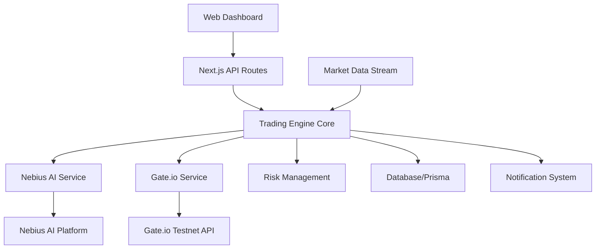

# Live Trading Bot AI - Design Document

## Overview

The Live Trading Bot AI is a sophisticated automated trading system that combines artificial intelligence from Nebius AI platform with real-time market execution through Gate.io testnet. The system processes live market data, generates AI-driven trading signals, and executes trades while maintaining strict risk management controls.

## Architecture

### High-Level Architecture



### System Components

1. **Trading Engine Core**: Central orchestrator managing all trading operations
2. **AI Analysis Service**: Interface to Nebius AI platform for market analysis
3. **Exchange Service**: Gate.io testnet API integration for trade execution
4. **Market Data Service**: Real-time market data collection and processing
5. **Risk Management Service**: Position sizing, stop-loss, and risk controls
6. **Notification Service**: Real-time updates and alerts
7. **Web Dashboard**: User interface for monitoring and control

## Components and Interfaces

### Trading Engine Core

**Purpose**: Central coordinator for all trading activities

**Key Methods**:
- `startTrading()`: Initialize trading session
- `stopTrading()`: Gracefully stop trading operations
- `processMarketData(data)`: Handle incoming market data
- `executeTradeSignal(signal)`: Process AI trading recommendations
- `updatePositions()`: Refresh position and balance information

**Dependencies**: AI Service, Exchange Service, Risk Manager, Database

### Nebius AI Service

**Purpose**: Interface with Nebius AI platform for market analysis

**Configuration**:
```typescript
interface NebiusConfig {
  apiUrl: string;
  jwtToken: string;
  model: string;
  maxRetries: number;
  timeout: number;
}
```

**Key Methods**:
- `authenticate()`: Establish connection with JWT token
- `analyzeMarket(marketData)`: Send market data for AI analysis
- `getTradeRecommendation(analysis)`: Receive trading signals
- `handleRateLimit()`: Manage API rate limiting

### Gate.io Exchange Service

**Purpose**: Execute trades and retrieve market data from Gate.io testnet

**Configuration**:
```typescript
interface GateConfig {
  baseUrl: 'https://fx-api-testnet.gateio.ws';
  apiKey: string;
  apiSecret: string;
  testnet: true;
}
```

**Key Methods**:
- `authenticate()`: Validate API credentials
- `getMarketData(symbol)`: Fetch real-time price and order book
- `getAccountBalance()`: Retrieve account balances
- `placeBuyOrder(symbol, amount, price)`: Execute buy orders
- `placeSellOrder(symbol, amount, price)`: Execute sell orders
- `getOpenPositions()`: Retrieve current positions
- `cancelOrder(orderId)`: Cancel pending orders

### Market Data Service

**Purpose**: Collect and process real-time market information

**Data Structure**:
```typescript
interface MarketData {
  symbol: string;
  timestamp: number;
  price: number;
  volume: number;
  orderBook: {
    bids: [price: number, amount: number][];
    asks: [price: number, amount: number][];
  };
  indicators: {
    rsi: number;
    macd: number;
    movingAverage: number;
  };
}
```

**Key Methods**:
- `subscribeToMarket(symbol)`: Start market data stream
- `processTickData(tick)`: Handle individual price updates
- `calculateIndicators(history)`: Compute technical indicators
- `validateDataIntegrity(data)`: Ensure data quality

### Risk Management Service

**Purpose**: Implement trading safety controls and position management

**Risk Parameters**:
```typescript
interface RiskConfig {
  maxDailyLoss: number;
  maxPositionSize: number;
  stopLossPercentage: number;
  maxOpenPositions: number;
  emergencyStopEnabled: boolean;
}
```

**Key Methods**:
- `validateTrade(tradeRequest)`: Check trade against risk parameters
- `calculatePositionSize(signal, balance)`: Determine appropriate trade size
- `checkStopLoss(position)`: Monitor positions for stop-loss triggers
- `enforceRiskLimits()`: Apply daily and position limits
- `emergencyStop()`: Halt all trading activities

## Data Models

### Trading Position
```typescript
interface TradingPosition {
  id: string;
  symbol: string;
  side: 'buy' | 'sell';
  amount: number;
  entryPrice: number;
  currentPrice: number;
  unrealizedPnL: number;
  timestamp: Date;
  status: 'open' | 'closed';
}
```

### Trading Signal
```typescript
interface TradingSignal {
  symbol: string;
  action: 'buy' | 'sell' | 'hold';
  confidence: number;
  targetPrice: number;
  stopLoss: number;
  reasoning: string;
  timestamp: Date;
}
```

### Trade Execution
```typescript
interface TradeExecution {
  id: string;
  orderId: string;
  symbol: string;
  side: 'buy' | 'sell';
  amount: number;
  price: number;
  fee: number;
  status: 'pending' | 'filled' | 'cancelled';
  timestamp: Date;
}
```

## Error Handling

### Connection Management
- **Nebius AI Connection**: Implement JWT token refresh and reconnection logic
- **Gate.io API Connection**: Handle rate limiting with exponential backoff
- **Network Failures**: Automatic retry with circuit breaker pattern

### API Error Handling
```typescript
interface ErrorHandler {
  handleNebiusError(error: NebiusError): void;
  handleGateError(error: GateError): void;
  handleNetworkError(error: NetworkError): void;
  logError(error: Error, context: string): void;
}
```

### Graceful Degradation
- Continue trading with cached AI analysis if Nebius is temporarily unavailable
- Switch to manual mode if critical systems fail
- Preserve system state during unexpected shutdowns

## Testing Strategy

### Unit Testing
- Test individual service methods with mocked dependencies
- Validate risk management calculations
- Test error handling scenarios

### Integration Testing
- Test Nebius AI service integration with real API calls
- Validate Gate.io testnet API integration
- Test end-to-end trading workflows

### Performance Testing
- Market data processing latency
- AI analysis response times
- Trade execution speed

### Security Testing
- API credential handling
- Data encryption in transit
- Input validation and sanitization

## Configuration Management

### Environment Variables
```typescript
interface AppConfig {
  // Nebius AI Configuration
  NEBIUS_API_URL: string;
  NEBIUS_JWT_TOKEN: string;
  NEBIUS_MODEL: string;

  // Gate.io Configuration
  GATE_API_KEY: string;
  GATE_API_SECRET: string;
  GATE_TESTNET: boolean;

  // Trading Configuration
  TRADING_PAIRS: string[];
  MAX_POSITION_SIZE: number;
  STOP_LOSS_PERCENTAGE: number;
  
  // System Configuration
  DATABASE_URL: string;
  LOG_LEVEL: string;
}
```

### Trading Parameters
- Configurable trading pairs (BTC/USDT, ETH/USDT, etc.)
- Adjustable risk parameters
- AI model selection and parameters
- Market data update intervals

## Monitoring and Logging

### Performance Metrics
- Trade execution latency
- AI analysis response time
- Market data processing rate
- System uptime and availability

### Business Metrics
- Total trades executed
- Profit/Loss tracking
- Win rate percentage
- Risk-adjusted returns

### Logging Strategy
- Structured logging with correlation IDs
- Separate logs for trading activities, system events, and errors
- Real-time log streaming to dashboard
- Log retention and archival policies

## Deployment Architecture

### Development Environment
- Local development with Gate.io testnet
- Mock Nebius AI responses for testing
- SQLite database for rapid iteration

### Production Environment
- Containerized deployment with Docker
- PostgreSQL database with connection pooling
- Redis for caching and session management
- Load balancing for high availability

### Monitoring and Alerting
- Real-time system health monitoring
- Trading performance dashboards
- Automated alerts for system failures
- Performance degradation notifications